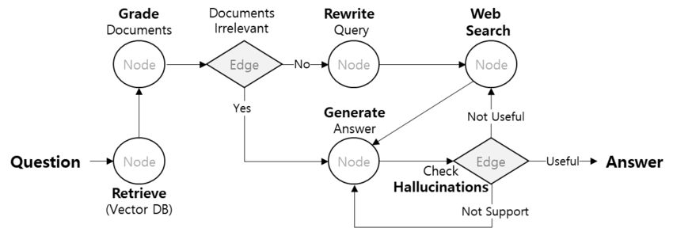
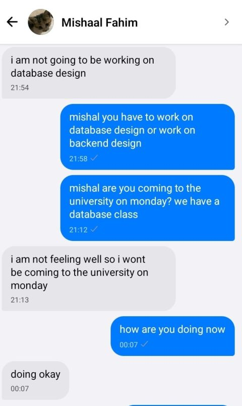
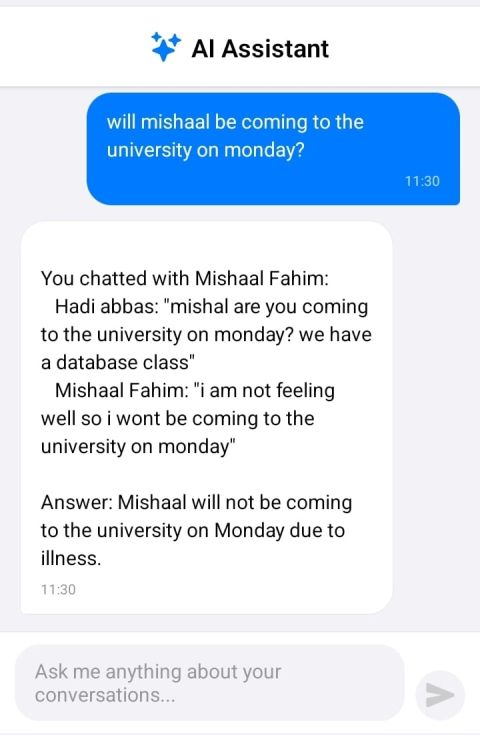

# Multi-Agent Chat Application with AI-Powered Retrieval

## Overview
This project is a fault-tolerant, multi-agent chat application that combines real-time messaging with AI-powered retrieval and summarization.

The system allows users not only to communicate in real-time but also to query past conversations using natural language. It uses a Retrieval-Augmented Generation (RAG) pipeline to extract relevant messages and generate meaningful summaries.

---

## Architecture

Frontend (React Native) → Backend (Django) → PostgreSQL  
                                      ↓  
                              Vector DB (Qdrant)  
                                      ↓  
                              LLM (Gemma 1-7B)

## IMPORTANT NOTE 
This Repo contains backend for communication pipelines, the actual VECTOR Backend is in a seperate repo "- LLM-Retrieval-Agent"
---

## Retrieval Architecte:

## Key Features

- Real-time messaging using WebSockets  
- Fault-tolerant message delivery (offline recovery)  
- Natural language querying of chat history  
- Semantic search using vector embeddings  
- AI-generated summaries of past conversations  
- JWT-based secure authentication  
- Hybrid communication (REST APIs + WebSockets)  

---

## AI Architecture (RAG Pipeline)

User Query → Embedding Model (BGE-Large) → Qdrant Vector Search  
→ Retrieve Relevant Messages → LLM (Gemma 1-7B) → Generated Response  

### Explanation
- Query is converted into vector embeddings  
- Similar messages are retrieved from vector database  
- Context is passed to LLM  
- LLM generates a summarized, meaningful response  

---

## Demonstration

### Example User Query

